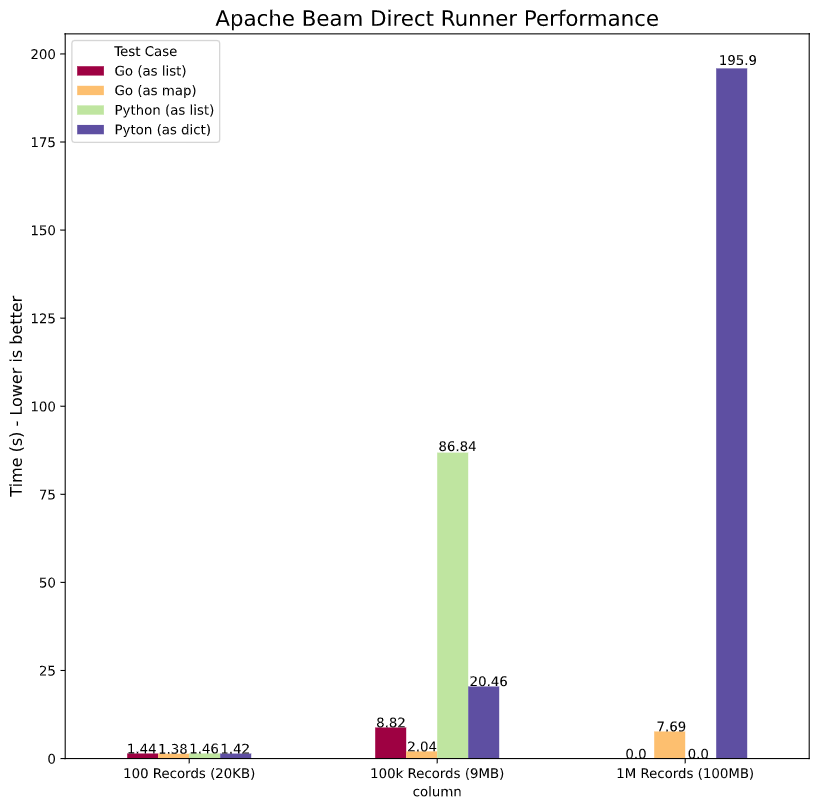

# Apache Beam Examples

Examples for `Apache Beam` / `Dataflow` in `Python` and `go`.

Based on my blog at [chollinger.com/blog/](https://chollinger.com/blog/).

Please see: 
1. [A Data Engineering Perspective on Go vs. Python (Part 1)](https://chollinger.com/blog/2020/06/a-data-engineering-perspective-on-go-vs.-python-part-1/)
2. [A Data Engineering Perspective on Go vs. Python (Part 2)](https://chollinger.com/blog/2020/07/a-data-engineering-perspective-on-go-vs.-python-part-2-dataflow/)

## Use Case
Shows differences betwen `Python` and `go` for `Apache Beam` by implementing a use case to parse `IMDb` movie data to find movies that match preferences.


## Implementations
Both `go` and `Python` code implement 3 ways of doing this, in increasing order of performance:
1. Using `lists` as `Side Input` and comparing for each element
2. Using `dicts`/`maps` as `Side Input` and looking up a match for each element _(does not work on Dataflow with go)_
3. Using `CoGroupByKey`

## Run Python
```
cd python/
pip3 install apache-beam==2.22.0 --upgrade
SUFFIX= # set to cogroup, side_list, side_map
python3 movie_pipeline_$SUFFIX.py --input-basics ../data/title.basics.100.tsv --output ./test.txt --input-ratings ../data/title.ratings.100.tsv
```

## Run go
```
cd go/
go get -u github.com/apache/beam/sdks/go/..
SUFFIX= # set to cogroup, movie_pipeline_side_list, side_map
go run movie_pipeline$SUFFIX.go --input-basics ../data/title.basics.100.tsv --input-ratings ../data/title.ratings.100.tsv --output ./test.txt
```

## Performance



## License
This project is licensed under the GNU GPLv3 License - see the [LICENSE](LICENSE) file for details.